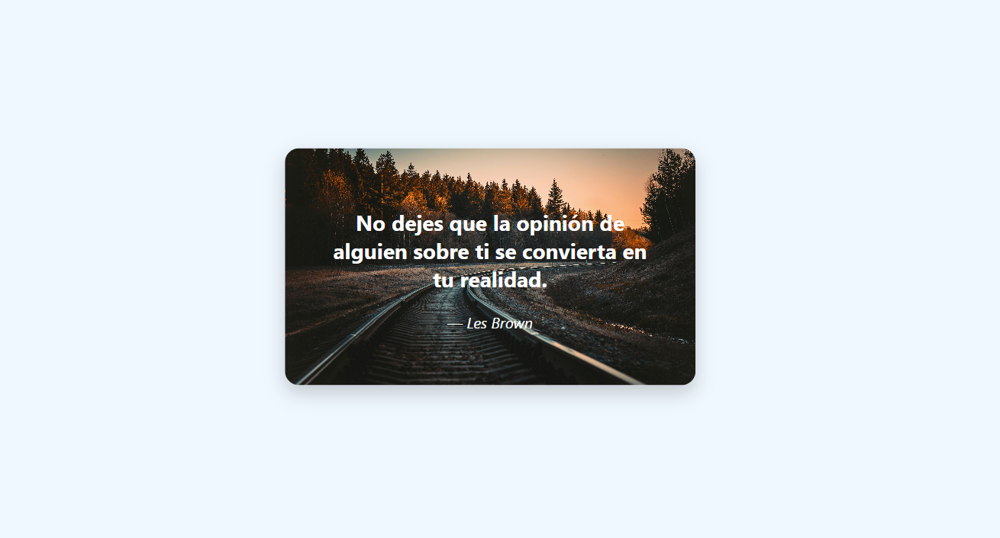

# 💌 Postal Digital en HTML y CSS

Este es un proyecto personal: una postal digital creada únicamente con HTML y CSS.  
Incluye una imagen de fondo, una frase inspiradora y diseño visual centrado en pantalla.

## 🌟 Características

- Imagen de fondo de alta calidad
- Frase motivadora centrada
- Tipografía elegante y moderna
- Diseño limpio con sombra y bordes redondeados

## ✨ Tecnologías usadas

- HTML5
- CSS3

## 📷 Vista previa

